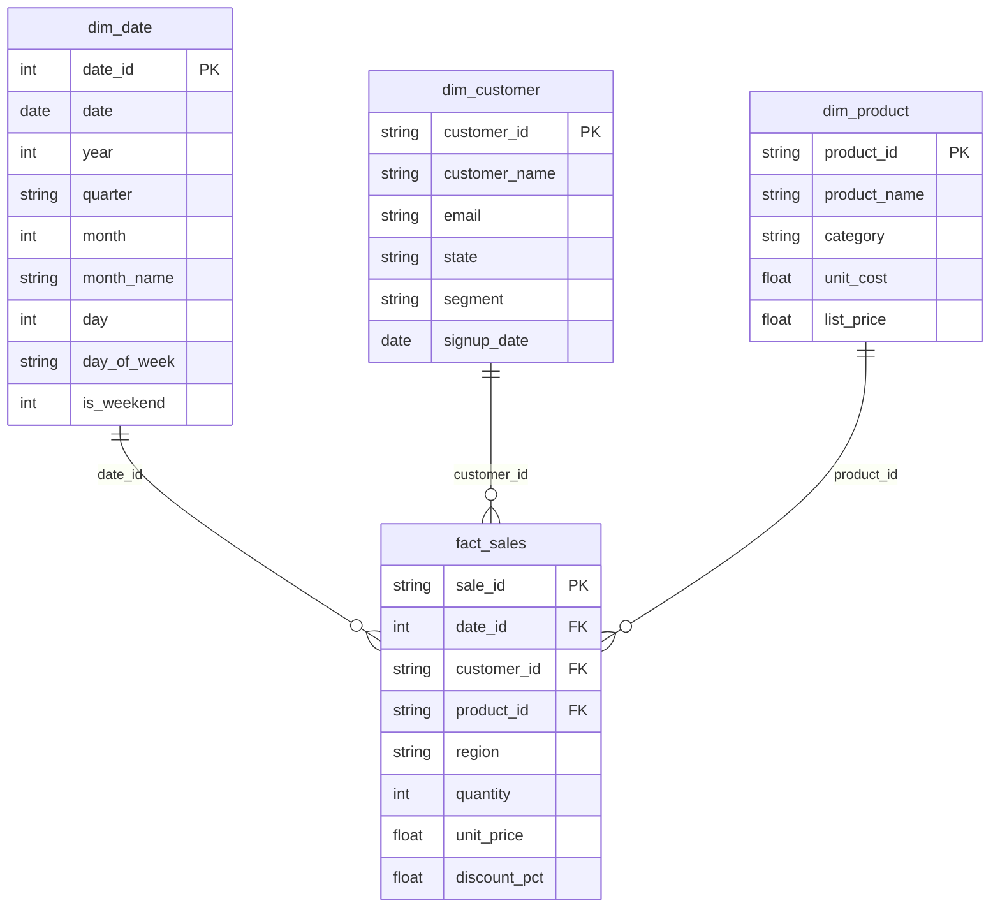

# Dashboard de Vendas em Power BI — Modelo Dimensional + DAX

Projeto de portfólio que entrega tudo o que é necessário para montar um
dashboard de vendas em Power BI Desktop: um dataset sintético já modelado em
**esquema estrela**, e um conjunto de **medidas DAX documentadas**.

> **Nenhum dado real é usado.** Clientes, produtos, vendas e datas são
> inteiramente sintéticos, gerados com a biblioteca `Faker`. Não há
> referência a empresas, clientes ou empregadores reais.

## Sobre o arquivo .pbix

Este repositório **não inclui um arquivo `.pbix`** — um binário do Power BI
não pode ser gerado por código de forma confiável/versionavel. Em vez disso,
o repositório fornece tudo que é necessário para montá-lo você mesmo no
Power BI Desktop em cerca de **15 minutos**: os dados já prontos em `data/`
e as medidas DAX já escritas em `dax/measures.md`. Basta importar, relacionar
e colar — veja o passo a passo abaixo.

## Modelo dimensional (esquema estrela)



- **`fact_sales`** é a tabela de fatos: uma linha por venda, com as métricas
  (`quantity`, `unit_price`, `discount_pct`) e as chaves estrangeiras para
  cada dimensão.
- **`dim_date`**, **`dim_customer`** e **`dim_product`** são as dimensões,
  cada uma com uma chave primária e atributos descritivos usados para
  filtrar/agrupar no relatório (categoria, região, segmento, ano, etc.).

Esse é o desenho clássico de esquema estrela: a tabela de fatos fica no
centro, ligada a cada dimensão por uma relação um-para-muitos, o que mantém
o modelo simples e rápido para o motor do Power BI (VertiPaq).

## Estrutura do repositório

```
powerbi-sales-dashboard/
├── data/
│   ├── generate_data.py     # script Python/Faker que gera os 4 CSVs abaixo
│   ├── dim_date.csv         # dimensão de data (2024-01-01 a 2025-12-31)
│   ├── dim_customer.csv     # dimensão de clientes (60 clientes sintéticos)
│   ├── dim_product.csv      # dimensão de produtos (26 produtos, 5 categorias)
│   └── fact_sales.csv       # fato de vendas (300 transações)
├── dax/
│   └── measures.md          # medidas DAX documentadas, prontas para colar
├── LICENSE
└── README.md
```

Os CSVs já vêm gerados e commitados — não é necessário rodar nada em Python
para montar o dashboard. O script `generate_data.py` é fornecido para quem
quiser regenerar os dados (com outra seed, outro volume, etc.).

## Passo a passo: montando o dashboard no Power BI Desktop

1. **Baixe/clone este repositório** e abra o Power BI Desktop.
2. **Importe os dados**: `Página Inicial → Obter Dados → Texto/CSV`, e
   importe, um de cada vez, os quatro arquivos de `data/`:
   `dim_date.csv`, `dim_customer.csv`, `dim_product.csv`, `fact_sales.csv`.
   Confirme o carregamento de cada um (`Carregar`).
3. **Marque a tabela de data**: selecione `dim_date` no painel de dados,
   vá em `Ferramentas de Tabela → Marcar como Tabela de Data`, e escolha a
   coluna `date`. Isso é necessário para funções de inteligência de tempo
   como `SAMEPERIODLASTYEAR` (usada na medida `YoY Growth %`).
4. **Crie as relações**: abra a visão de modelo (`Modelagem → Gerenciar
   Relações` ou a aba "Modelo" na lateral) e crie três relações,
   todas um-para-muitos (1 → *) partindo da dimensão para o fato:
   - `dim_date[date_id]` → `fact_sales[date_id]`
   - `dim_customer[customer_id]` → `fact_sales[customer_id]`
   - `dim_product[product_id]` → `fact_sales[product_id]`
5. **Crie as medidas DAX**: no painel de dados, clique com o botão direito
   em `fact_sales → Nova Medida`, e cole cada uma das medidas de
   [`dax/measures.md`](dax/measures.md) (Total Sales, Total Orders,
   Avg Ticket, YoY Growth %, Running Total Sales, Top Category Share).
   Crie `Total Sales` primeiro — as demais dependem dela.
6. **Monte as visualizações**: com as medidas prontas, monte cartões de KPI
   (Total Sales, Total Orders, Avg Ticket), um gráfico de linha por
   `dim_date[date]` (Total Sales e Running Total Sales), um gráfico de
   barras por `dim_product[category]`, e um mapa ou gráfico por
   `fact_sales[region]`. Use `dim_customer[segment]` e `dim_customer[state]`
   como segmentadores (slicers).
7. **Salve como `.pbix`** — o arquivo fica local, na sua máquina.

## O que este projeto demonstra

- **Modelagem dimensional**: desenho de esquema estrela com dimensão de
  data completa (incluindo atributos derivados como trimestre e fim de
  semana), prática padrão de Business Intelligence.
- **DAX aplicado a perguntas de negócio reais**: cada medida resolve uma
  pergunta concreta (receita, ticket médio, crescimento ano a ano,
  acumulado, concentração por categoria), não apenas sintaxe isolada.
- **Geração de dados sintéticos estruturados** com `Faker`, respeitando
  integridade referencial entre fato e dimensões.
- **Documentação clara de modelo de dados**, incluindo diagrama ER,
  pensada para quem for consumir o dataset sem precisar investigar o
  código.

## Licença

Distribuído sob a licença MIT — veja [LICENSE](LICENSE).
